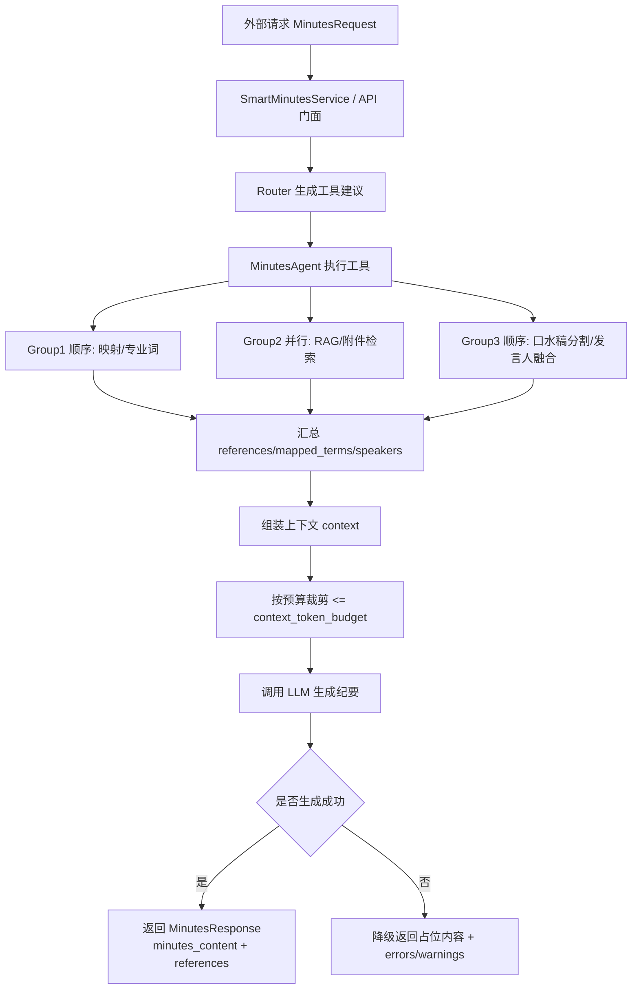
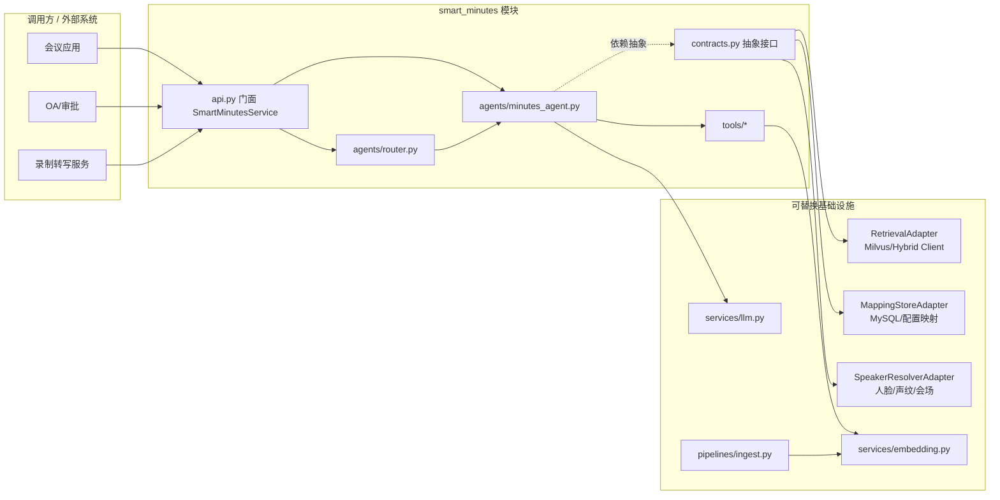

# 智能会议纪要

基于 LLM Agent 的智能会议纪要模块：历史纪要检索、模板与动态 Prompt 生成、发言人融合、映射与附件检索等。

## 文档

- **[对接手册](docs/INTEGRATION.md)**：进程内/HTTP 对接、依赖注入、与现有 Milvus 对接要点、数据约定
- **[使用指南](docs/USAGE.md)**：快速开始、请求与响应、环境变量、能力与输入对应、常见问题

## 技术栈

- Python 3.10+
- Milvus（向量检索）
- LangChain（Agent 编排）

## 项目结构

```
smart_minutes/     # 智能纪要独立功能包（门面 + 契约 + Agent + 工具）
pipelines/         # 数据入库与向量化
api/               # FastAPI：/api/smart-minutes/generate、/retrieve、/generate-stream
config/            # 配置
data/              # 数据模型
services/          # 共享能力（embedding、llm）
```

## 执行流程图



## 组件架构图



## 开发

```bash
python -m venv .venv
.venv\Scripts\activate   # Windows
pip install -r requirements.txt
uvicorn api.main:app --reload   # 启动 API
```

## Linux 子模块部署
 
 如果你将本仓库作为 Git Submodule 或子目录放置在主工程的 `src/service/smart_minutes` 下，并希望独立启动 HTTP 服务：
 
 ```bash
 # 假设在主工程根目录
 export PYTHONPATH=$(pwd)
 
 # 启动服务（建议用 Systemd 或 Supervisor 管理）
 uvicorn src.service.smart_minutes.api.main:app --host 0.0.0.0 --port 18080
 ```
 
 若需通过 Nginx 反向代理流式接口，请务必关闭缓冲：
 
 ```nginx
 location /api/smart-minutes/generate-stream {
     proxy_pass http://127.0.0.1:18080;
     proxy_buffering off;  # 关键：否则 SSE 会被缓冲
     proxy_cache off;
 }
 ```
 
 ## License

Private / 内部使用
