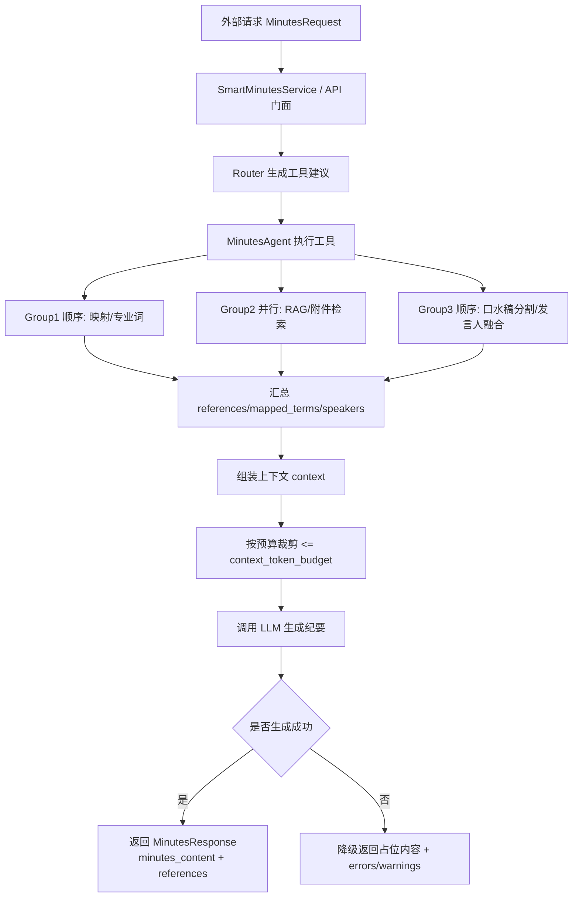
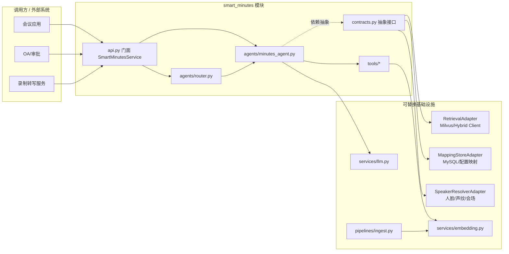

# 智能会议纪要

基于 LLM Agent 的智能会议纪要模块：历史纪要检索、模板与动态 Prompt 生成、发言人融合、映射与附件检索等。

## 当前能力（2026-03）

- **结构化输出**：`MinutesResponse` 支持 `structured_output`（会议信息、议题、材料引用、追溯信息）。
- **发言人融合**：返回 `speaker_resolutions`（候选集、置信度、冲突状态）。
- **同系列检索**：支持会议名称规范化、`project/department/organization` 过滤。
- **分类型检索**：支持 `todo/open_issue/conclusion` 分别检索与权重参数透传。
- **入库校验**：`pipelines/ingest.py` 对 `source=minutes` 启用 type 归一化与规则校验。
- **LLM 语义切分**：口水稿按议题切分使用 Qwen3-30B-A3B 进行语义理解。
- **不确定性标记**：议题切分结果支持 `is_ambiguous` 和 `confidence` 标记。
- **扩展字段生成**：入库时自动生成 `summary_short`、`keywords`、`sentiment`、`importance` 等字段。
- **Schema 管理**：支持扩展字段注册、生成、迁移与预览。

## 文档

- **[对接手册](docs/INTEGRATION.md)**：进程内/HTTP 对接、Pipeline 对接、依赖注入、Milvus/MySQL 约定
- **[API 参考](docs/API.md)**：所有 v1 端点、请求/响应示例
- **[使用指南](docs/USAGE.md)**：快速开始、请求与响应、环境变量、常见问题
- **[数据模型](docs/DATA_MODEL.md)**：Milvus 字段、MySQL 表与用途
- **[需求文档](docs/requirements_smart_minutes.md)**：完整规格

## 技术栈

- Python 3.10+
- Milvus（向量检索）
- LangChain（Agent 编排）

## 项目结构

```
smart_minutes/     # 智能纪要独立功能包（门面 + 契约 + Agent + 工具）
pipelines/         # 数据入库与向量化
api/               # FastAPI：/api/smart-minutes/generate、/retrieve、/generate-stream
config/            # 配置
data/              # 数据模型
services/          # 共享能力（embedding、llm）
```

## 执行流程图




## 组件架构图




## 开发

```bash
python -m venv .venv
.venv\Scripts\activate   # Windows
pip install -r requirements.txt
uvicorn api.main:app --reload   # 启动 API
pytest -q                        # 运行测试
```

## 9 大功能与 API 一览

| 功能 | 方法 | 路径 | 说明 |
|------|------|------|------|
| 生成纪要 | POST | `/api/v1/smart-minutes/generate` | 一次性返回纪要正文与引用 |
| 流式生成 | POST | `/api/v1/smart-minutes/generate-stream` | SSE 流式输出 |
| 仅检索 | POST | `/api/v1/smart-minutes/retrieve` | 不调 LLM，返回 references 等 |
| 同系列历史纪要 | POST | `/api/v1/smart-minutes/query/series` | 按会议类型/名检索同系列纪要 |
| 议题/相似议题历史 | POST | `/api/v1/smart-minutes/query/by-topic` | 按议题检索历史片段 |
| 按人查询 | POST | `/api/v1/smart-minutes/query/by-person` | 按人名检索（支持口头称呼→正式名） |
| 附件信息 | POST | `/api/v1/smart-minutes/query/attachments` | 会议相关政策/附件列表 |
| 口水稿→议题名 | POST | `/api/v1/smart-minutes/query/topic-from-draft` | 从口水稿反推相似议题 |
| 类似待办/遗留 | POST | `/api/v1/smart-minutes/query/similar-todos-issues` | 检索相似待办与遗留问题 |
| 类似议题结论 | POST | `/api/v1/smart-minutes/query/similar-conclusions` | 检索相似结论 |
| 人名映射 | POST | `/api/v1/smart-minutes/mappings/oral-names` | 批量添加口头称呼→正式名映射 |
| Chunk-主题匹配 | POST | `/api/v1/smart-minutes/match-chunks-to-topics` | 为 chunk 分配主题 |
| 专有名词提取 | POST | `/api/v1/smart-minutes/extract-proper-nouns` | 从文本提取专有名词 |
| 专有名词列表 | GET | `/api/v1/smart-minutes/proper-nouns?kb_name=xxx` | 按知识库查询专有名词 |
| MD 入库 | POST | `/api/v1/smart-minutes/ingest-from-md` | 从 MD 文件入库 Milvus |

详见 [docs/API.md](docs/API.md) 与 [docs/INTEGRATION.md](docs/INTEGRATION.md)。

## 接口一览（核心）

| 方法 | 路径 | 说明 |
|------|------|------|
| `GET` | `/health` | 健康检查 |
| `POST` | `/api/v1/smart-minutes/generate` | 生成纪要 |
| `POST` | `/api/v1/smart-minutes/generate-stream` | 流式生成 |
| `POST` | `/api/v1/smart-minutes/retrieve` | 仅检索 |

generate/retrieve 请求体为 [`MinutesRequest`](smart_minutes/schemas.py)，响应为 [`MinutesResponse`](smart_minutes/schemas.py)。

**`MinutesResponse` 关键字段一览：**


| 字段 | 类型 | 说明 |
|------|------|------|
| `minutes_content` | string | 生成的纪要正文 |
| `structured_output` | object | 结构化纪要（`meeting_info`、`topics[]`、`materials[]`、`traceability`） |
| `references` | array | 检索到的参考片段（含 `pk`、`score`、`source`、`topic`、`source_id` 等） |
| `resolved_speakers` | string[] | 融合后的发言人正式名 |
| `speaker_resolutions` | array | 多模态融合详情（`resolved_name`、`confidence`、`candidates[]`、`status`） |
| `mapped_terms` | string[] | 专业词与口头→正式名映射结果 |
| `warnings` | string[] | 部分失败告警（如某路检索未命中） |
| `errors` | array | 错误列表（`code`、`message`） |
| `partial` | boolean | 是否部分成功 |


**SSE 流式接口（`generate-stream`）阶段事件：**


| `stage` 值 | 时机 | 包含字段 |
|------------|------|----------|
| `smart_minutes_start` | 请求收到后立即 | `meeting_name`、`topics` |
| `prepare_done` | 工具执行完毕 | `tool_count`、`reference_count`、`token_budget`、`context_chars` |
| `warnings` | 生成结束前（有告警时） | `warnings`、`partial` |


---

## 最小请求示例（含 retrieval_weights）

```json
{
  "meeting_type": "周会",
  "meeting_name": "产品周会",
  "project": "alpha",
  "department": "product",
  "topics": ["需求评审", "进度同步"],
  "open_issues": ["测试环境稳定性不足"],
  "conclusions": ["本周冻结需求范围"],
  "draft_text": "今天先过需求评审，再讨论上线节奏。",
  "options": {
    "top_k": 5,
    "retrieval_weights": {
      "todo": { "type_weight": 0.8, "dense_weight": 0.6, "sparse_weight": 0.4 },
      "open_issue": { "type_weight": 1.4, "dense_weight": 0.7, "sparse_weight": 0.3 },
      "conclusion": { "type_weight": 1.2, "dense_weight": 0.65, "sparse_weight": 0.35 }
    }
  }
}
```

该请求可用于 `POST /api/v1/smart-minutes/generate` 或 `POST /api/v1/smart-minutes/retrieve`。

## meeting_type 模板配置（JSON/YAML 二选一）

在 `.env` 中，`SMART_MINUTES_TEMPLATES_PATH` 指向模板文件即可；JSON 与 YAML 任选其一：

```env
# JSON 示例（二选一）
SMART_MINUTES_TEMPLATES_PATH=config/templates.json

# YAML 示例（二选一）
# SMART_MINUTES_TEMPLATES_PATH=config/templates.yaml
```

请求中传 `meeting_type` 后，会自动套用模板里的默认 `top_k` 与检索权重；参数优先级为：**请求 options > meeting_type 模板 > 全局默认值**。

## Linux 子模块部署

 如果你将本仓库作为 Git Submodule 或子目录放置在主工程的 `src/service/smart_minutes` 下，并希望独立启动 HTTP 服务：

 ```bash
 # 假设在主工程根目录
 export PYTHONPATH=$(pwd)
 
 # 启动服务（建议用 Systemd 或 Supervisor 管理）
 uvicorn src.service.smart_minutes.api.main:app --host 0.0.0.0 --port 18080
 ```
 
 若需通过 Nginx 反向代理流式接口，请务必关闭缓冲：

 ```nginx
 location /api/v1/smart-minutes/generate-stream {
     proxy_pass http://127.0.0.1:18080;
     proxy_buffering off;  # 关键：否则 SSE 会被缓冲
     proxy_cache off;
 }
 ```
 
## License

Private / 内部使用