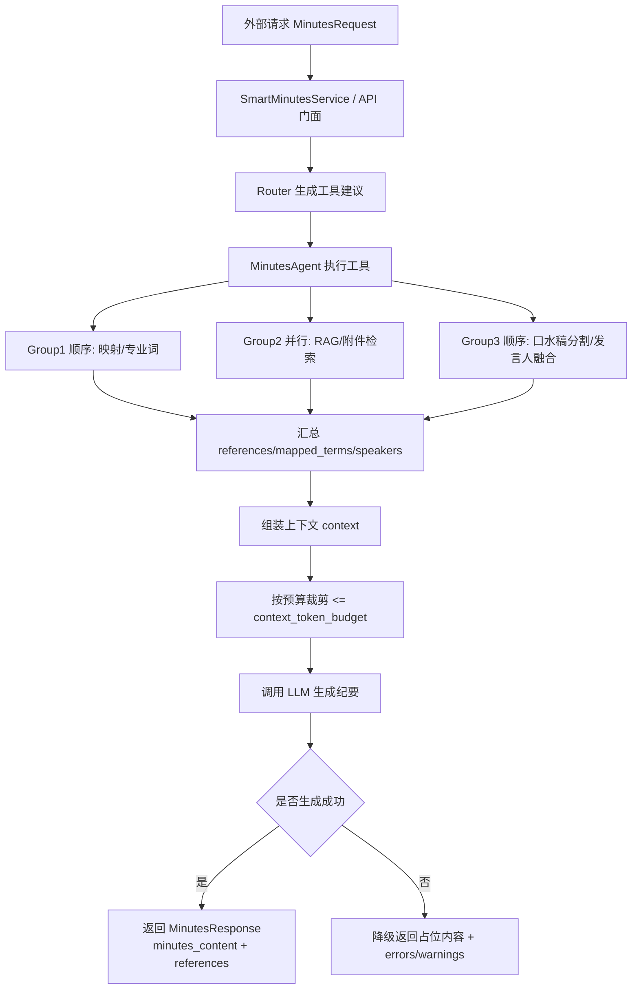
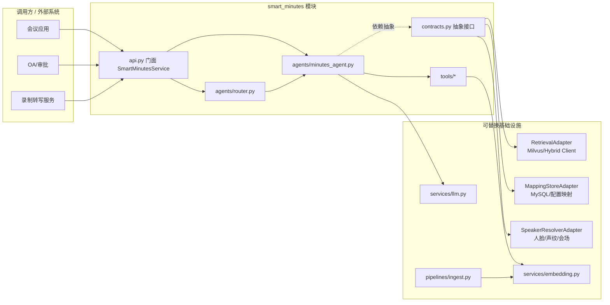

# 智能纪要对接手册

面向将智能纪要作为**独立模块**接入会议应用、OA、录制服务等场景的开发者。

---

## 一、对接方式概览

| 方式 | 适用场景 | 依赖 |
|------|----------|------|
| **进程内** | 同一 Python 进程，直接 `import` 调用 | 注入 IRetrieval、IMappingStore、ISpeakerResolver |
| **HTTP** | 跨进程/跨语言，通过 REST 调用 | 部署 `api/main.py`，请求/响应为 JSON |

### 1.1 执行流程图



### 1.2 组件架构图



---

## 二、进程内对接

### 2.1 依赖的抽象接口

模块只依赖三个抽象（定义在 `smart_minutes.contracts`），由**调用方**提供实现并注入：

| 接口 | 职责 | 必须实现的方法 |
|------|------|----------------|
| **IRetrieval** | 向量/混合检索 | `search(query_text, *, topic_filter, source_filter, level1_filter, author_filter, type_filter, top_k) -> List[dict]` |
| **IMappingStore** | 口头→人名、会议类型→专业词 | `resolve_oral_to_formal(oral_name) -> Optional[str]`<br>`get_professional_terms(meeting_type, meeting_name) -> List[str]` |
| **ISpeakerResolver** | 人脸/声纹/会场 → 发言人 | `resolve_speaker(face_result, voice_result, venue_name) -> Optional[str]`（可选） |

返回的 `dict` 建议包含：`pk`, `score`, `page_content`, `source`, `level1`, `level2`, `author`, `time`, `version`, `topic`。

### 2.2 使用本仓库自带的适配器

若使用现有 Milvus 混合检索客户端，可用 `RetrievalAdapter` 包装：

```python
from smart_minutes import SmartMinutesService, MinutesRequest, MinutesResponse
from smart_minutes.adapters.retrieval import RetrievalAdapter
from smart_minutes.adapters.mapping_store import MappingStoreAdapter
from smart_minutes.adapters.speaker_resolver import SpeakerResolverAdapter

# 假设已有 MilvusHybridClient，且 search 支持 filter=expr
milvus_client = ...  # 你的 MilvusHybridClient 实例
retrieval = RetrievalAdapter(client=milvus_client, collection_name="your_collection")
mapping = MappingStoreAdapter(initial_oral_map={"老张": "张三"})  # 或从 DB 加载
speaker = SpeakerResolverAdapter()  # 或接入真人脸/声纹 API

service = SmartMinutesService(retrieval, mapping, speaker)
request = MinutesRequest(meeting_name="周例会", topics=["进度同步"], oral_names=["老张"])
response = service.run(request)
print(response.minutes_content)
print(response.references)
```

### 2.3 自定义实现注入

实现 Protocol 即可，无需继承：

```python
class MyRetrieval:
    def search(self, query_text, *, topic_filter=None, source_filter=None, level1_filter=None,
               author_filter=None, type_filter=None, top_k=5, **kwargs):
        # 调用你的向量库，返回 [{"pk": ..., "score": ..., "page_content": ..., ...}]
        return []

service = SmartMinutesService(MyRetrieval(), my_mapping, my_speaker)
```

### 2.4 配置

- 集合名、top_k、上下文预算等可通过 `SmartMinutesConfig` 传入，或由环境变量提供（见 `.env.example`）。
- `SmartMinutesService(..., config=SmartMinutesConfig(collection_name="xx", context_token_budget=8000))`

---

## 三、HTTP 对接

### 3.1 启动服务

```bash
cd /path/to/mettings
pip install -r requirements.txt
uvicorn api.main:app --host 0.0.0.0 --port 8000
```

### 3.2 生产环境注入真实实现

默认 `api/main.py` 使用 stub 适配器（无真实 Milvus）。生产需在应用启动时构造真实 `RetrievalAdapter`、`MappingStoreAdapter`、`SpeakerResolverAdapter`，再创建 `SmartMinutesService` 并挂到 `app.state.service`（可改 `lifespan` 或用依赖注入）。

### 3.3 接口与契约

- **POST /api/smart-minutes/generate**：生成纪要，请求体为 `MinutesRequest` 的 JSON，响应为 `MinutesResponse`。
 - **POST /api/smart-minutes/generate-stream**：流式生成纪要，SSE 协议返回阶段事件与正文 token。
 - **POST /api/smart-minutes/retrieve**：仅检索，不生成正文；请求体同，响应中 `minutes_content` 为空，`references` 等有值。
- **GET /health**：健康检查。

请求/响应字段见 [使用指南 - 请求与响应](USAGE.md#二请求与响应)。

### 3.4 流式接口与 SSE 协议
 
 接口：`POST /api/smart-minutes/generate-stream`
 
 响应为 `Content-Type: text/event-stream`，包含两类消息：
 
 1. **阶段事件 (Stage Event)**：
    - 格式：`data: {"stage": "...", "think": "...", ...}`
    - 用途：前端展示“正在执行某步骤”。
    - 关键事件：
      - `smart_minutes_start`：开始执行。
      - `prepare_done`：工具执行完毕，上下文准备就绪（含 token 预算）。
      - `warnings`：执行结束前的告警汇总。
 
 2. **Token 数据 (OpenAI Chunk)**：
    - 格式：`data: {"object": "chat.completion.chunk", "choices": [{"delta": {"content": "..."}}]}`
    - 用途：流式拼接纪要正文。
    - 结束标志：`data: [DONE]`
 
 ---
 
 ## 四、与现有 Milvus 混合检索的对接要点

若已有 `MilvusHybridClient.search(query_text, knowledge_base_name, top_k, topic_filter=..., file_list=...)`：

1. **filter 扩展**：`RetrievalAdapter` 会拼 `filter` 表达式（含 `source`、`topic`、`level1`、`author`、`type`）。若现有 client 的 `search` 支持 `filter=expr` 参数，直接传入即可；否则需在 client 侧增加对 `filter` 的支持，或由适配器只传 `topic_filter`/`file_list`（则部分过滤在应用层做）。
2. **返回格式**：client 返回的 hit 建议为 `hit["entity"]` 存标量、`hit["distance"]` 存分数；适配器会转为 `page_content`、`source` 等统一 dict。
3. **output_fields**：若需「口水稿→相似议题名」，检索结果中需包含 `topic` 字段，请在 client 的 `output_fields` 中加入 `topic`。

---

## 五、数据约定（Milvus Schema）

为保证检索与过滤正确，入库时需约定：

- `source`：`minutes`（纪要）/ `attachment`（附件）/ `draft`（口水稿）
- `type`：`summary` / `open_issue` / `conclusion` / `draft_segment` / `policy_chunk` 等
- `level1`：会议类型或会议名称（同系列过滤）
- `topic`：议题名
- `author`：发言人正式名
- `time`：ISO 时间戳（同系列最新排序）

详见项目计划文档「五、数据模型与存储」。

---

## 六、错误与降级

- 响应中 `partial=true` 表示部分成功（如某路检索失败、映射未命中）。
- 未完成项会写入 `warnings`；严重错误可写入 `errors`。
- 即使部分失败，仍会尽量返回已生成的 `minutes_content` 与 `references`，便于调用方降级展示或重试。

---

## 七、版本与兼容

- 对外契约以 `smart_minutes.schemas` 中的 `MinutesRequest`、`MinutesResponse` 为准；新增可选字段保持向后兼容。
- 内部 Agent、工具、路由可能随版本调整，调用方仅依赖门面与契约即可。
