# 智能会议纪要系统 - 详细架构图

## 1. 整体数据流架构图

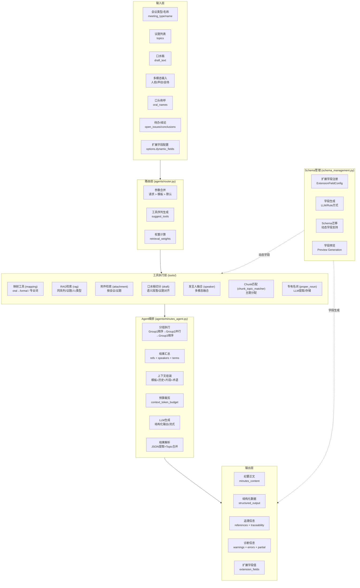

---

## 2. 模块依赖关系图

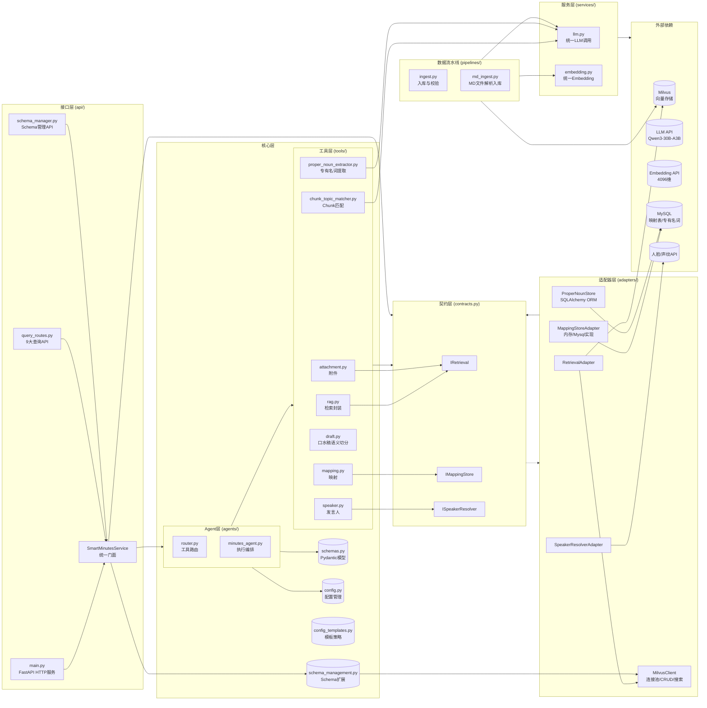

---

## 3. 详细请求处理流程图

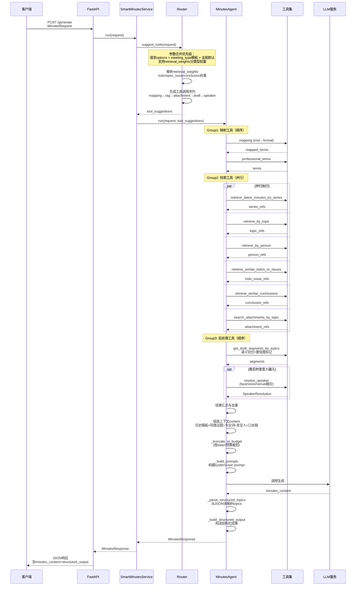

---

## 4. 数据模型关系图

```mermaid
erDiagram
    MinutesRequest ||--o{ Topic : contains
    MinutesRequest ||--o{ RealtimeSpeaker : has
    MinutesRequest ||--o{ Options : has
    
    MinutesResponse ||--|| StructuredMinutesOutput : contains
    MinutesResponse ||--o{ ReferenceItem : references
    MinutesResponse ||--o{ SpeakerResolution : speakers
    MinutesResponse ||--o{ ErrorItem : errors
    
    StructuredMinutesOutput ||--|| MeetingInfo : meeting_info
    StructuredMinutesOutput ||--o{ TopicSection : topics
    StructuredMinutesOutput ||--o{ MaterialCitation : materials
    StructuredMinutesOutput ||--|| TraceabilityInfo : traceability
    
    TopicSection ||--o{ ActionItem : action_items
    SpeakerResolution ||--o{ SpeakerCandidate : candidates
    
    ExtensionFieldConfig ||--o{ SchemaMigrationRequest : migrates
    
    MinutesRequest {
        string meeting_type
        string meeting_name
        string meeting_time
        string project
        string department
        string organization
        string draft_text
        string topics
        string person_names
        string oral_names
        string open_issues
        string conclusions
        string options
        string realtime_speaker
    }
    
    TopicSection {
        string topic_name
        string summary
        string key_points
        string conclusions
        string open_issues
        string action_items
        string source_ref_ids
        number confidence
    }
    
    ActionItem {
        string content
        string owner
        string deadline
        string status
        string source_ref_ids
        string source_minutes_id
    }
    
    ReferenceItem {
        number pk
        number score
        string page_content
        string source
        string type
        string topic
        string author
        string time
        string source_id
        string source_position
        number confidence
        string owner
        string deadline
    }
    
    SpeakerResolution {
        string resolved_name
        number confidence
        string candidates
        string status
        string conflict_reason
    }
    
    TraceabilityInfo {
        string history_minutes_ids
        string attachment_positions
        string speaker_resolution
        string per_fact_sources
    }
    
    ExtensionFieldConfig {
        string field_name
        string field_type
        string description
        string generation_method
        string generation_prompt
        string rule_expression
        string enabled
    }
```

---

## 5. RAG检索策略细节图

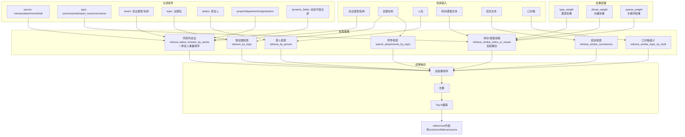

---

## 6. 发言人融合决策流程图

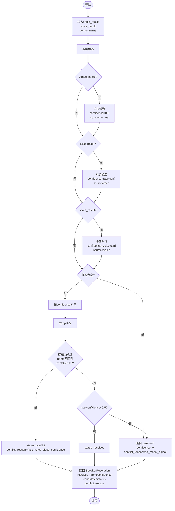

---

## 7. 上下文组装与裁剪流程图

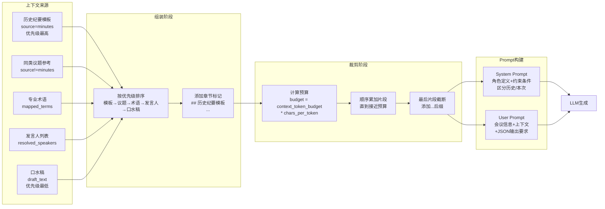

---

## 8. 数据入库流水线图

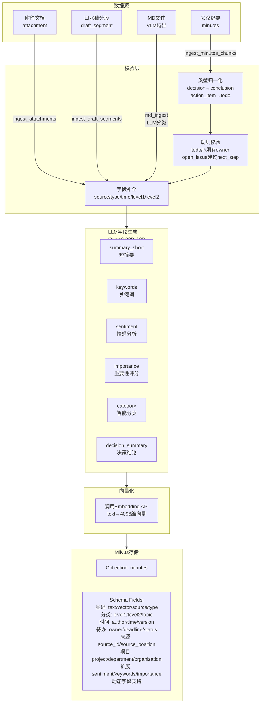

---

## 9. 口水稿语义切分流程图

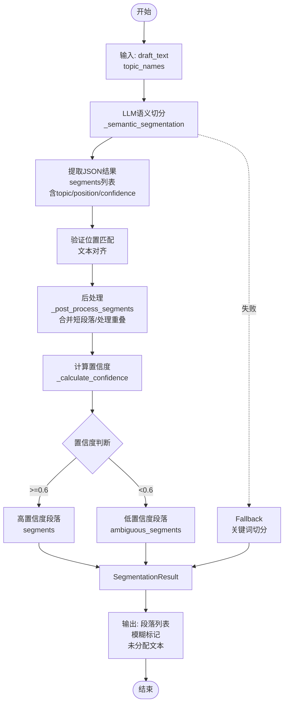

---

## 10. Schema扩展管理流程图

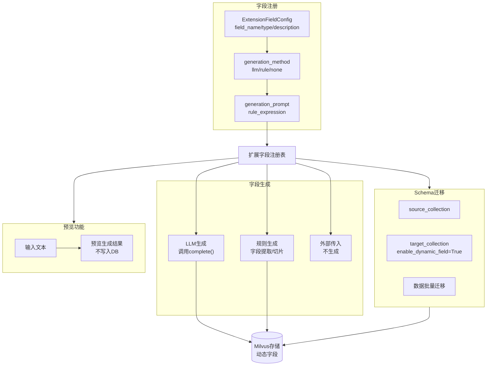

---

## 11. 部署架构图

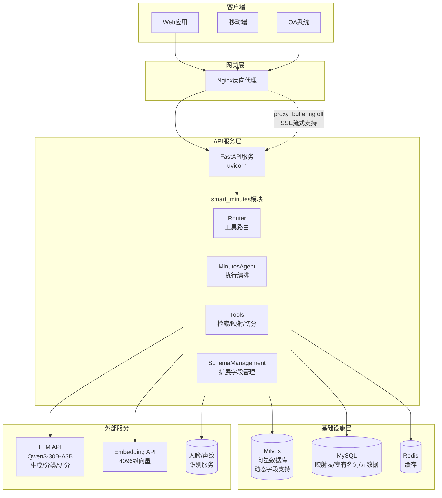

---

## 12. 会议类型模板继承关系图

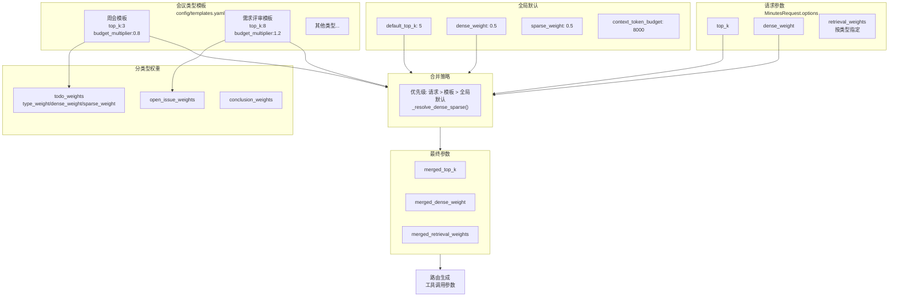

---

## 13. 错误处理与降级策略图

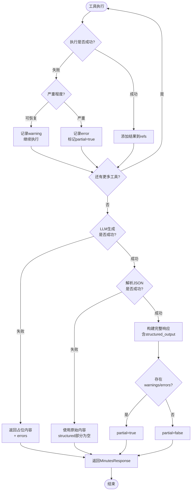

---

## 14. API 功能总览

### 14.1 核心生成 API

| API 路径 | 方法 | 功能描述 |
|---------|------|---------|
| `/api/v1/smart-minutes/generate` | POST | 生成完整纪要 |
| `/api/v1/smart-minutes/retrieve` | POST | 仅检索，不调用LLM |
| `/api/v1/smart-minutes/generate-stream` | POST | 流式生成纪要 |
| `/api/v1/smart-minutes/ingest-from-md` | POST | MD文件解析入库 |

### 14.2 独立查询 API (9大功能)

| API 路径 | 底层工具 | 功能描述 |
|---------|---------|---------|
| `/api/v1/smart-minutes/query/series` | retrieve_latest_minutes_by_series | 同系列历史纪要 |
| `/api/v1/smart-minutes/query/by-topic` | retrieve_by_topic | 议题/相似议题历史 |
| `/api/v1/smart-minutes/query/by-person` | retrieve_by_person + resolve_oral_to_formal_candidates | 按人查询 |
| `/api/v1/smart-minutes/query/attachments` | get_attachments_by_meeting | 附件信息 |
| `/api/v1/smart-minutes/query/topic-from-draft` | retrieve_similar_topic_by_draft | 口水稿→议题名 |
| `/api/v1/smart-minutes/query/similar-todos-issues` | retrieve_similar_todos_or_issues | 类似待办/遗留 |
| `/api/v1/smart-minutes/query/similar-conclusions` | retrieve_similar_conclusions | 类似议题结论 |

### 14.3 映射与匹配 API

| API 路径 | 功能描述 |
|---------|---------|
| `/api/v1/smart-minutes/mappings/oral-names` | 批量添加口头称呼映射 |
| `/api/v1/smart-minutes/match-chunks-to-topics` | Chunk-主题匹配 |

### 14.4 专有名词 API

| API 路径 | 方法 | 功能描述 |
|---------|------|---------|
| `/api/v1/smart-minutes/extract-proper-nouns` | POST | 提取专有名词并存储 |
| `/api/v1/smart-minutes/proper-nouns` | GET | 查询专有名词列表 |

### 14.5 Schema 管理 API

| API 路径 | 方法 | 功能描述 |
|---------|------|---------|
| `/api/v1/schema/info/{collection_name}` | GET | 获取Schema信息 |
| `/api/v1/schema/register-field` | POST | 注册扩展字段 |
| `/api/v1/schema/registered-fields` | GET | 列出已注册字段 |
| `/api/v1/schema/register-field/{field_name}` | DELETE | 注销扩展字段 |
| `/api/v1/schema/generate-fields` | POST | 为存量数据生成字段 |
| `/api/v1/schema/migrate` | POST | Schema迁移 |
| `/api/v1/schema/preview-field-generation` | POST | 预览字段生成 |

---

## 15. Milvus Collection Schema 设计

### 15.1 基础字段 (固定)

| 字段名 | 类型 | 说明 |
|-------|------|------|
| pk | INT64 | 主键，自增 |
| text | VARCHAR(65535) | 文本内容 |
| vector | FLOAT_VECTOR(4096) | 向量嵌入 |

### 15.2 核心元数据字段

| 字段名 | 类型 | 说明 |
|-------|------|------|
| source | VARCHAR(64) | 来源：minutes/attachment/draft |
| type | VARCHAR(64) | 类型：summary/todo/open_issue/conclusion |
| level1 | VARCHAR(256) | 一级分类（会议类型） |
| level2 | VARCHAR(256) | 二级分类 |
| topic | VARCHAR(256) | 议题名 |
| author | VARCHAR(128) | 作者/发言人 |

### 15.3 时间与版本字段

| 字段名 | 类型 | 说明 |
|-------|------|------|
| time | VARCHAR(32) | 时间戳 |
| version | VARCHAR(32) | 版本号 |
| source_id | VARCHAR(256) | 来源ID（文档标识） |
| source_position | VARCHAR(256) | 来源位置 |

### 15.4 待办相关字段

| 字段名 | 类型 | 说明 |
|-------|------|------|
| owner | VARCHAR(128) | 待办负责人 |
| deadline | VARCHAR(32) | 截止时间 |
| status | VARCHAR(32) | 状态 |

### 15.5 项目维度字段

| 字段名 | 类型 | 说明 |
|-------|------|------|
| project | VARCHAR(128) | 项目名 |
| department | VARCHAR(128) | 部门 |
| organization | VARCHAR(128) | 组织 |

### 15.6 扩展字段 (动态)

| 字段名 | 类型 | 生成方式 |
|-------|------|---------|
| summary_short | VARCHAR | LLM生成 |
| summary_detailed | VARCHAR | LLM生成 |
| keywords | JSON | LLM生成 |
| sentiment | VARCHAR | LLM生成 |
| importance | INT | LLM生成 |
| category | VARCHAR | LLM生成 |
| decision_summary | VARCHAR | LLM生成 |
| action_items_structured | JSON | LLM生成 |

---

*文档版本: 2026-03-03*  
*对应代码版本: smart_minutes v2.0*  
*更新内容: 新增Schema管理、动态字段、LLM字段生成、专有名词存储、口水稿语义切分*
