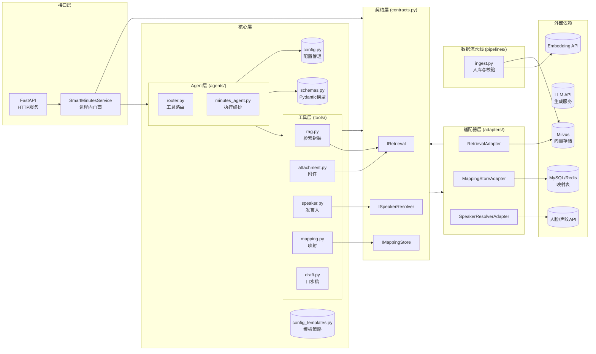
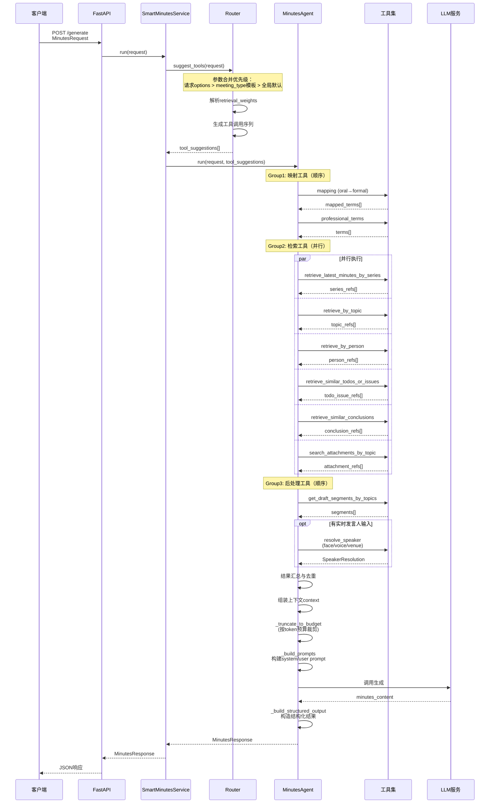
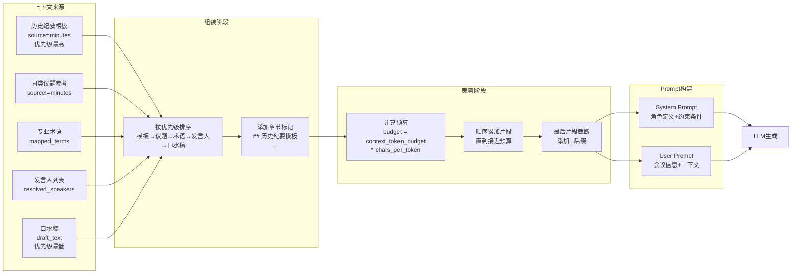
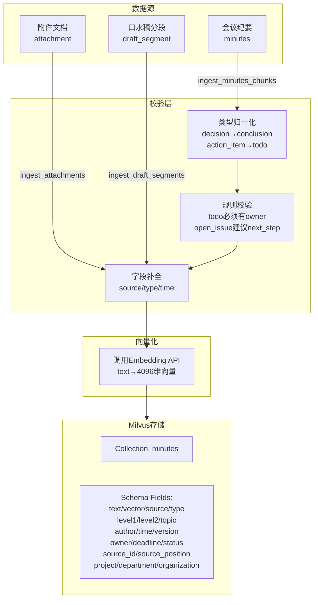
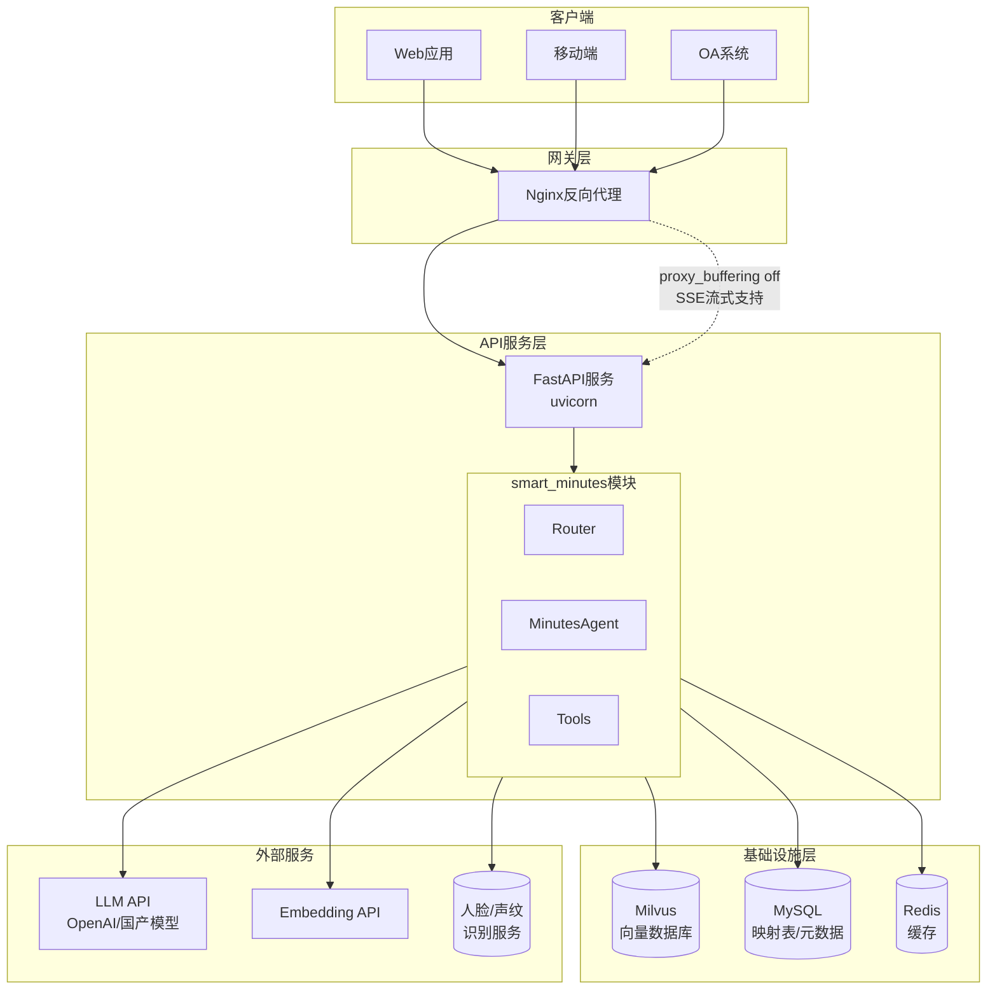
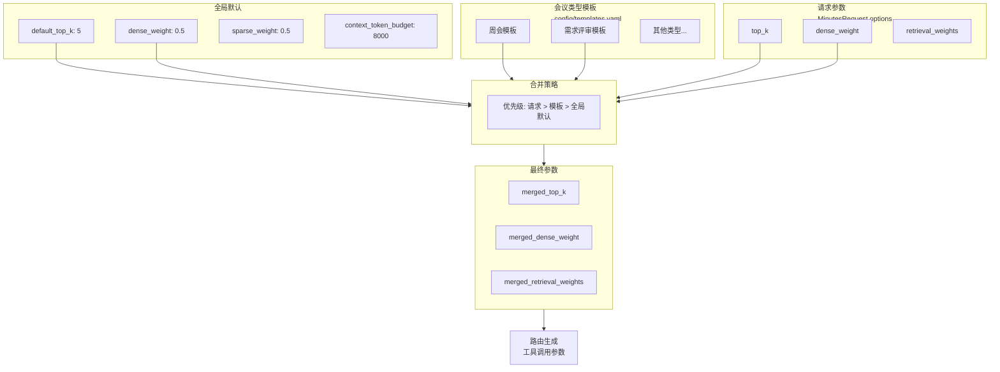
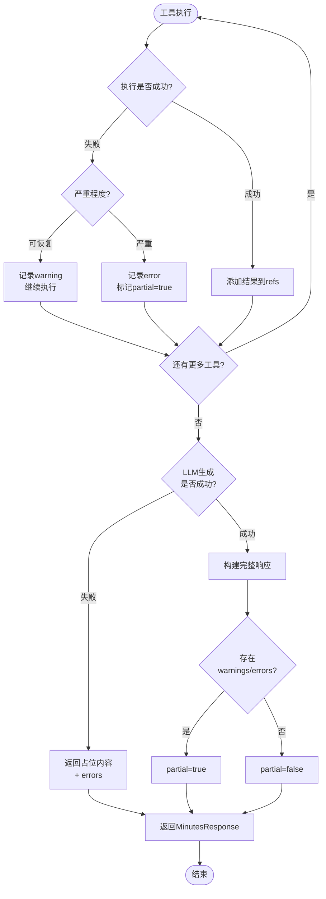

# 智能会议纪要系统 - 详细架构图

## 1. 整体数据流架构图

```mermaid
flowchart TB
    subgraph Input["输入层"]
        I1[会议类型/名称<br/>meeting_type/name]
        I2[议题列表<br/>topics[]]
        I3[口水稿<br/>draft_text]
        I4[多模态输入<br/>人脸/声纹/会场]
        I5[口头称呼<br/>oral_names[]]
        I6[待办/结论<br/>open_issues/conclusions]
    end

    subgraph Router["路由层 (agents/router.py)"]
        R1[参数合并<br/>请求 > 模板 > 默认]
        R2[工具序列生成<br/>suggest_tools]
        R3[权重计算<br/>retrieval_weights]
    end

    subgraph Tools["工具执行层 (tools/)"]
        direction TB
        T1["映射工具 (mapping)<br/>oral→formal / 专业词"] 
        T2["RAG检索 (rag)<br/>同系列/议题/人/类型"]
        T3["附件检索 (attachment)<br/>按会议/议题"]
        T4["口水稿切分 (draft)<br/>按议题分段"]
        T5["发言人融合 (speaker)<br/>多模态融合"]
    end

    subgraph Agent["Agent编排 (agents/minutes_agent.py)"]
        A1[分组执行<br/>Group1顺序→Group2并行→Group3顺序]
        A2[结果汇总<br/>refs + speakers + terms]
        A3[上下文组装<br/>模板+历史+片段+术语]
        A4[预算裁剪<br/>context_token_budget]
        A5[LLM生成<br/>结构化输出]
    end

    subgraph Output["输出层"]
        O1[纪要正文<br/>minutes_content]
        O2[结构化数据<br/>structured_output]
        O3[追溯信息<br/>references + traceability]
        O4[诊断信息<br/>warnings + errors + partial]
    end

    Input --> Router
    Router --> Tools
    Tools --> Agent
    Agent --> Output
```

---

## 2. 模块依赖关系图



---

## 3. 详细请求处理流程图



---

## 4. 数据模型关系图

```mermaid
erDiagram
    MinutesRequest ||--o{ Topic : contains
    MinutesRequest ||--o{ RealtimeSpeaker : has
    MinutesRequest ||--o{ Options : has
    
    MinutesResponse ||--|| StructuredMinutesOutput : contains
    MinutesResponse ||--o{ ReferenceItem : references
    MinutesResponse ||--o{ SpeakerResolution : speakers
    MinutesResponse ||--o{ ErrorItem : errors
    
    StructuredMinutesOutput ||--|| MeetingInfo : meeting_info
    StructuredMinutesOutput ||--o{ TopicSection : topics
    StructuredMinutesOutput ||--o{ MaterialCitation : materials
    StructuredMinutesOutput ||--|| TraceabilityInfo : traceability
    
    TopicSection ||--o{ ActionItem : action_items
    SpeakerResolution ||--o{ SpeakerCandidate : candidates
    
    MinutesRequest {
        string meeting_type
        string meeting_name
        string project
        string department
        string organization
        string draft_text
        array topics
        array person_names
        array oral_names
        array open_issues
        array conclusions
        object options
    }
    
    TopicSection {
        string topic_name
        string summary
        array key_points
        array conclusions
        array open_issues
        array action_items
        array source_ref_ids
        float confidence
    }
    
    ActionItem {
        string content
        string owner
        string deadline
        string status
        array source_ref_ids
    }
    
    ReferenceItem {
        int pk
        float score
        string page_content
        string source
        string topic
        string author
        string time
        string source_id
        string source_position
        float confidence
    }
    
    SpeakerResolution {
        string resolved_name
        float confidence
        array candidates
        string status
        string conflict_reason
    }
    
    TraceabilityInfo {
        array history_minutes_ids
        array attachment_positions
        array speaker_resolution
    }
```

---

## 5. RAG检索策略细节图

```mermaid
flowchart TD
    subgraph Input["检索输入"]
        Q1[会议类型/名称]
        Q2[议题名称]
        Q3[人名]
        Q4[待办/遗留文本]
        Q5[结论文本]
        Q6[口水稿]
    end

    subgraph Filters["过滤条件"]
        F1[source: minutes/attachment/draft]
        F2[type: summary/todo/open_issue/conclusion]
        F3[level1: 会议类型/名称]
        F4[topic: 议题名]
        F5[author: 发言人]
        F6[project/department/organization]
    end

    subgraph Weights["权重配置"]
        W1[type_weight<br/>类型权重]
        W2[dense_weight<br/>向量权重]
        W3[sparse_weight<br/>关键词权重]
    end

    subgraph Strategy["检索策略"]
        S1["同系列会议<br/>retrieve_latest_minutes_by_series"]
        S2["按议题检索<br/>retrieve_by_topic"]
        S3["按人检索<br/>retrieve_by_person"]
        S4["待办/遗留双路<br/>retrieve_similar_todos_or_issues"]
        S5["结论检索<br/>retrieve_similar_conclusions"]
        S6["口水稿语义<br/>retrieve_similar_topic_by_draft"]
        S7["附件检索<br/>search_attachments_by_topic"]
    end

    subgraph Merge["结果融合"]
        M1[加权重排序]
        M2[去重]
        M3[Top-K截取]
    end

    Q1 --> S1
    Q2 --> S2
    Q3 --> S3
    Q4 --> S4
    Q5 --> S5
    Q6 --> S6
    Q2 --> S7
    
    F1 --> S1
    F2 --> S4
    F3 --> S1
    F4 --> S2
    F5 --> S3
    F6 --> S1
    
    W1 --> S4
    W2 --> S4
    W3 --> S4
    
    S1 --> M1
    S2 --> M1
    S3 --> M1
    S4 --> M1
    S5 --> M1
    S6 --> M1
    S7 --> M1
    
    M1 --> M2
    M2 --> M3
    M3 --> References[references[]
    带score/confidence/source]
```

---

## 6. 发言人融合决策流程图

```mermaid
flowchart TD
    Start([开始]) --> Input[输入: face_result<br/>voice_result<br/>venue_name]
    
    Input --> Collect[收集候选]
    
    Collect --> Venue{venue_name?}
    Venue -->|有| AddVenue[添加候选<br/>confidence=0.6<br/>source=venue]
    Venue -->|无| Face{face_result?}
    
    AddVenue --> Face
    
    Face -->|有| AddFace[添加候选<br/>confidence=face.conf<br/>source=face]
    Face -->|无| Voice{voice_result?}
    
    AddFace --> Voice
    
    Voice -->|有| AddVoice[添加候选<br/>confidence=voice.conf<br/>source=voice]
    Voice -->|无| CheckEmpty{候选为空?}
    
    AddVoice --> CheckEmpty
    
    CheckEmpty -->|是| Unknown[返回 unknown<br/>confidence=0]
    CheckEmpty -->|否| Sort[按confidence排序]
    
    Sort --> GetTop[取top候选]
    
    GetTop --> CheckTop2{存在top2且<br/>name不同且<br/>conf差<0.15?}
    
    CheckTop2 -->|是| Conflict[status=conflict<br/>conflict_reason=face_voice_close]
    CheckTop2 -->|否| CheckLowConf{top.confidence<0.5?}
    
    Conflict --> Output
    CheckLowConf -->|是| Unknown
    CheckLowConf -->|否| Resolved[status=resolved]
    
    Resolved --> Output[返回 SpeakerResolution<br/>resolved_name<br/>confidence<br/>candidates[]<br/>status]
    Unknown --> Output
    
    Output --> End([结束])
```

---

## 7. 上下文组装与裁剪流程图



---

## 8. 数据入库流水线图



---

## 9. 部署架构图



---

## 10. 会议类型模板继承关系图



---

## 11. 错误处理与降级策略图



---

*文档版本: 2026-02-28*
*对应代码版本: smart_minutes v1.0*
